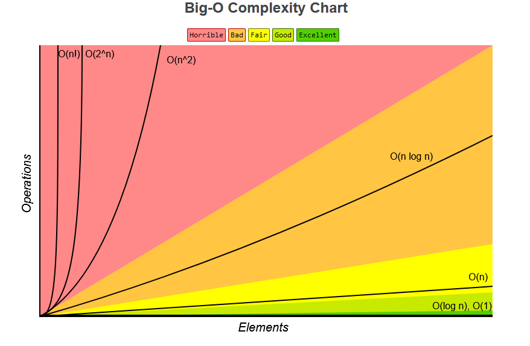

# Big-O Notation

Big-O notation is a mathematical concept used to describe the performance or complexity of an algorithm. Specifically, it characterizes functions according to their growth rates: how quickly they grow relative to the size of the input data.

## Examples - Time Complexities

Consider an array of numbers:

```python
A = [1, 2, 3, 4, 5]
```

In practice, the array can have N elements, where N can be any positive integer.

Now, our task is to return a new array B which contains each element of A squared.

```python
B = [1, 4, 9, 16, 25]
```

We can achieve this using a simple looping function:

```python
def square_array(A: list) -> list:
    B = []
    for number in A:
        B.append(number ** 2)
    return B
```

This function has to visit each element of the input array A exactly once to compute its square. Therefore, if the size of the input array is N, the function will perform N operations. In Big-O notation, we express this linear relationship as O(N), indicating that the time complexity of the function grows linearly with the size of the input array. We say this has a time complexity of O(N).

Let us consider another example where we want to return an array C with the pairs of all elements in A without duplicates.:

```python
C = [(1, 2), (1, 3), (1, 4), (1, 5),
     (2, 3), (2, 4), (2, 5),
     (3, 4), (3, 5),
     (4, 5)]
```

This algorithm roughly has a time complexity of O(N^2) because for each element in the array, we have to pair it with every other element. Thus, if the size of the input array is N, the number of operations grows quadratically with the size of the input array. We can implement this as follows:

```python
def pair_array(A: list) -> list:
    C = []
    for i in range(len(A)):
        for j in range(i + 1, len(A)):
            C.append((A[i], A[j]))
    return C
```

## Examples - Space Complexities

Big-O notation can also be used to describe the space complexity of an algorithm, which refers to the amount of memory an algorithm uses in relation to the size of the input data.

In the `square_array` function above, we create a new array B that stores the squared values of each element in A. If A has N elements, then B will also have N elements. Therefore, the space complexity of this function is O(N), as the amount of memory used grows linearly with the size of the input array.

But, if we modify the `square_array` function to square the elements in place, we can reduce the space complexity to O(1):

```python
def square_array_in_place(A: list) -> list:
    for i in range(len(A)):
        A[i] = A[i] ** 2
    return A
```

In this modified version, we do not create a new array; instead, we update the elements of the input array A directly. Therefore, the space complexity is O(1), indicating that the amount of memory used does not grow with the size of the input array.

There are O(1) time complexity algorithms as well. For example, accessing an element in an array by its index takes constant time, regardless of the size of the array:

## Closing Notes

There is usually a trade-off between time and space complexity. An algorithm that uses more memory (higher space complexity) may run faster (lower time complexity), and vice versa. Understanding Big-O notation helps in analyzing and optimizing algorithms for better performance.

There is usually a simpler way to write a complex Big-O notation. For example, O(N + N^2) can be simplified to O(N^2) because as N grows larger, the N^2 term will dominate the growth rate. Similarly, O(3N) simplifies to O(N) since constant factors are ignored in Big-O notation. Because, we are usually interested in the worst thing we are doing during the algorithm.



---
